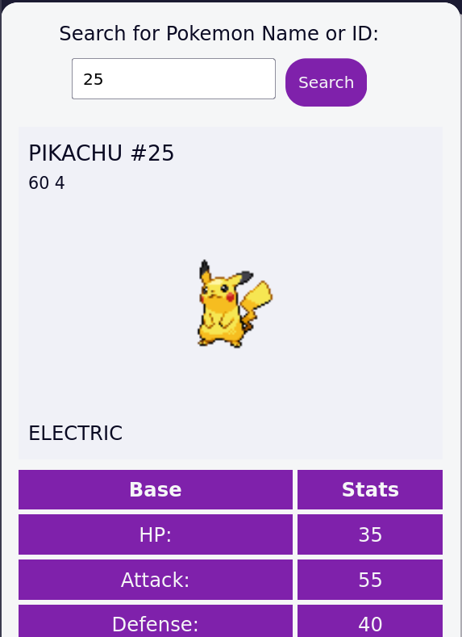
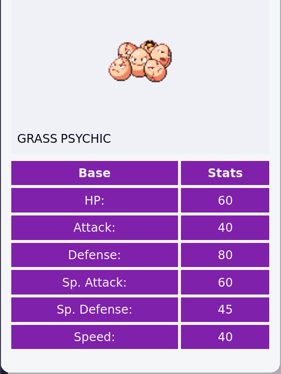

# Pokémon Search App

A simple web application that fetches and displays information about Pokémon based on their name or ID. The app uses the PokeAPI to retrieve data such as the Pokémon’s stats, types, height, weight, and a sprite image. This project is built as part of practicing JavaScript skills, especially working with APIs, promises, and DOM manipulation.

## Project Features

- Fetches Pokémon data from the PokeAPI based on user input (name or ID).
- Displays the Pokémon's name, ID, types, stats (HP, attack, defense, etc.), and sprite.
- Handles invalid inputs and displays an error message if the Pokémon is not found.

## Screenshot

 

## Project Requirements

- Fetch and display Pokémon data using JavaScript Fetch API.
- Handle asynchronous requests using `async/await` syntax.
- Clear previous search results before displaying new Pokémon data.
- Display an appropriate error message when no matching Pokémon is found.

## This Project is Part of FreeCodeCamp Certification

This project is built as part of the FreeCodeCamp JavaScript Algorithms and Data Structures Certification. It is designed to practice and demonstrate understanding of JavaScript fundamentals, APIs, and DOM manipulation.

